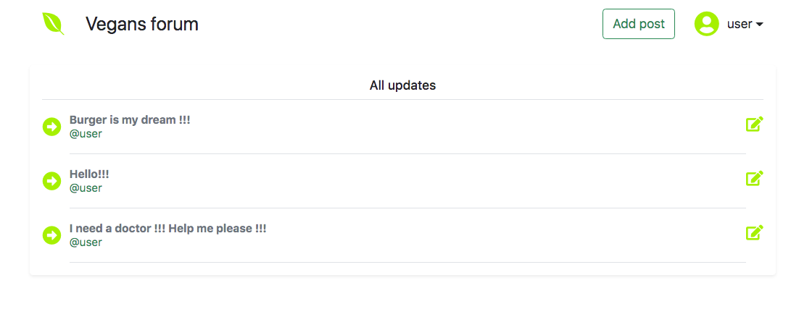

[Ссылка на сервер в приложением](https://shielded-thicket-52036.herokuapp.com/)

В этом уроке мы избавимся от tomcat за счет модуля Spring Boot.

В качестве проекта мы сделаем классическое приложение - форум.

Создайте под него отдельный репозиторий job4j_forum.

Добавьте maven, checkstyle. Сделайте описание README.

Задание

1. Создайте репозиторий job4j_forum.

2. Создайте виды и контроллеры.

index.jsp - список тем.

reg.jsp - регистрация пользователя.

login.jsp - авторизация пользователя.

edit.jsp - создание и редактирование темы.

post.jsp - тема и обсуждения.

3. Создайте модели Post, User.

4. Хранение данных в памяти. Базу данных подключать не надо.

5. Загрузите код в репозиторий. Оставьте ссылку на коммит.

6. Переведите ответственного на Петра Арсентьева.